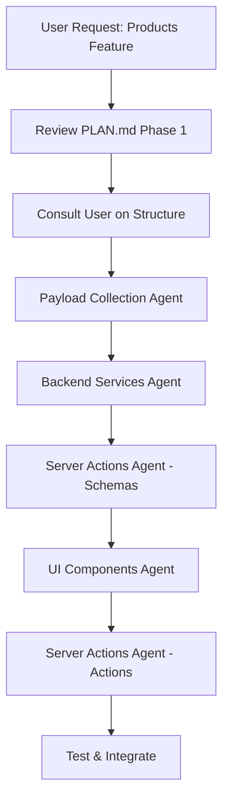

# Stocker - Documentation Index

> Complete guide to project structure, development methodology, and resources

## 📚 Documentation Structure

```
project-root/
├── AGENTS.md                    # Main agent instructions (READ THIS FIRST)
├── README.md                    # Project overview
├── docs/
│   └── PLAN.md                  # Complete development roadmap
├── agents/                      # Specialized agent documentation
│   ├── README.md               # Agent architecture overview
│   ├── PAYLOAD_COLLECTIONS.md  # Database schema agent
│   ├── BACKEND_SERVICES.md     # Data layer agent
│   ├── UI_COMPONENTS.md        # UI layer agent
│   └── SERVER_ACTIONS.md       # Actions & validation agent
└── skills/                      # Technology-specific guidelines
    ├── nextjs-15/
    │   └── SKILL.md            # Next.js 15 best practices
    ├── react-19/
    │   └── SKILL.md            # React 19 patterns
    ├── tailwind-4/
    │   └── SKILL.md            # Tailwind CSS 4 guidelines
    ├── zod-3/
    │   └── SKILL.md            # Zod validation patterns
    └── payload/
        └── AGENTS.md           # Payload CMS comprehensive guide
```

---

## 🚀 Quick Start for AI Agents

### First-Time Setup

1. **Read** [AGENTS.md](./AGENTS.md) - Main instructions and methodology
2. **Review** [docs/PLAN.md](./docs/PLAN.md) - Development roadmap
3. **Understand** [agents/README.md](./agents/README.md) - Multi-agent architecture

### Before Starting Any Task

1. **Identify** which phase/feature from PLAN.md
2. **Determine** which agent(s) to use (see Agent Selection below)
3. **Consult** user if creating collections or data structures
4. **Reference** relevant skill documentation

---

## 🤖 Agent Selection Guide

| Task Type                 | Use This Agent           | Documentation                                             |
| ------------------------- | ------------------------ | --------------------------------------------------------- |
| Create collection/schema  | Payload Collection Agent | [PAYLOAD_COLLECTIONS.md](./agents/PAYLOAD_COLLECTIONS.md) |
| Fetch/mutate data         | Backend Services Agent   | [BACKEND_SERVICES.md](./agents/BACKEND_SERVICES.md)       |
| Build UI components       | UI Components Agent      | [UI_COMPONENTS.md](./agents/UI_COMPONENTS.md)             |
| Form validation & actions | Server Actions Agent     | [SERVER_ACTIONS.md](./agents/SERVER_ACTIONS.md)           |

---

## 📖 Skill Documentation

### [Next.js 15](./skills/nextjs-15/SKILL.md)

- App Router patterns
- Server vs Client Components
- Data fetching strategies
- Caching and revalidation
- Server Actions
- Metadata and SEO

### [React 19](./skills/react-19/SKILL.md)

- React Compiler
- New hooks (use, useOptimistic, useActionState)
- Component patterns
- Performance optimization
- Form handling
- Custom hooks

### [Tailwind CSS 4](./skills/tailwind-4/SKILL.md)

- Utility-first approach
- Design tokens (CSS variables)
- Responsive design
- Dark mode
- Component patterns
- Container queries

### [Zod 3](./skills/zod-3/SKILL.md)

- Schema definition
- Validation patterns
- Type inference
- Form integration
- Custom validation
- Error handling

### [Payload CMS](./skills/payload/AGENTS.md)

- Collection configuration (1142 lines)
- Field types
- Access control
- Hooks
- Local API
- Admin customization

---

## 🎯 Development Workflow

### Standard Feature Development

```
1. User Request
   ↓
2. Main Agent Reviews PLAN.md
   ↓
3. Identify Required Agents
   ↓
4. Consult User (if creating collections)
   ↓
5. Execute Agent Tasks in Order:
   a. Payload Collection Agent (if needed)
   b. Backend Services Agent
   c. Server Actions Agent (schemas)
   d. UI Components Agent
   e. Server Actions Agent (actions)
   ↓
6. Integration & Testing
   ↓
7. Update PLAN.md Progress
```

### Example: Creating Products Feature



---

## ⚠️ Critical Rules

### NEVER Skip These:

1. **Consultation Before Collections**
   - Always ask user about data structure
   - Propose based on PLAN.md but wait for confirmation
   - Structures in PLAN.md are proposals, not final instructions

2. **No Hardcoded Values**
   - Use constants for select options
   - Use environment variables for config
   - Use design tokens for colors/spacing

3. **Type Safety**
   - Use generated Payload types
   - Infer types from Zod schemas
   - No `any` types

4. **Service Layer Pattern**
   - Server Components → Services → Payload API
   - Server Actions → Services → Payload API
   - Never call Payload API directly from actions

5. **Access Control**
   - Implement for ALL collections
   - Filter by owner for multi-tenancy
   - Check user role in actions

---

## 📋 Project Status

### ✅ Completed

- Infrastructure setup
- Authentication system
- User management
- Layout and navigation
- Feature flags
- Documentation complete

### 🔲 Todo (See PLAN.md for details)

- Phase 0: Settings
- Phase 1: Products
- Phase 2: Sellers
- Phase 3: Customers
- Phase 4: Assignments
- Phase 5: Sales
- Phase 6: Stock History
- Phase 7: Dashboard

---

## 🛠️ Technology Stack

| Layer      | Technology       | Documentation                                |
| ---------- | ---------------- | -------------------------------------------- |
| Framework  | Next.js 15       | [SKILL.md](./skills/nextjs-15/SKILL.md)      |
| UI         | React 19         | [SKILL.md](./skills/react-19/SKILL.md)       |
| Styling    | Tailwind CSS 4   | [SKILL.md](./skills/tailwind-4/SKILL.md)     |
| Components | shadcn/ui        | [UI Components](./agents/UI_COMPONENTS.md)   |
| Backend    | Payload CMS 3.x  | [AGENTS.md](./skills/payload/AGENTS.md)      |
| Database   | PostgreSQL       | -                                            |
| Validation | Zod 3            | [SKILL.md](./skills/zod-3/SKILL.md)          |
| Actions    | next-safe-action | [Server Actions](./agents/SERVER_ACTIONS.md) |

---

## 📦 Project Structure

```
src/
├── app/
│   ├── (frontend)/          # Frontend routes
│   │   ├── (auth)/          # Login, register
│   │   └── (main)/          # Protected routes
│   ├── (payload)/           # Payload admin (don't modify)
│   └── services/            # Backend service layer
├── collections/             # Payload collections
├── components/              # React components
│   ├── ui/                  # shadcn/ui base components
│   ├── layout/              # Layout components
│   ├── [feature]/           # Feature components
│   └── shared/              # Shared components
├── hooks/                   # Custom React hooks
└── lib/                     # Utilities
```

---

## 🔍 Finding Information

### "How do I...?"

| Question                  | Documentation                                                                                   |
| ------------------------- | ----------------------------------------------------------------------------------------------- |
| Create a new collection?  | [PAYLOAD_COLLECTIONS.md](./agents/PAYLOAD_COLLECTIONS.md)                                       |
| Fetch data from Payload?  | [BACKEND_SERVICES.md](./agents/BACKEND_SERVICES.md)                                             |
| Build a form?             | [UI_COMPONENTS.md](./agents/UI_COMPONENTS.md) + [SERVER_ACTIONS.md](./agents/SERVER_ACTIONS.md) |
| Validate form data?       | [Zod SKILL.md](./skills/zod-3/SKILL.md)                                                         |
| Create a Server Action?   | [SERVER_ACTIONS.md](./agents/SERVER_ACTIONS.md)                                                 |
| Style a component?        | [Tailwind SKILL.md](./skills/tailwind-4/SKILL.md)                                               |
| Use Server Components?    | [Next.js SKILL.md](./skills/nextjs-15/SKILL.md)                                                 |
| Implement access control? | [PAYLOAD_COLLECTIONS.md](./agents/PAYLOAD_COLLECTIONS.md)                                       |
| Create a custom hook?     | [React SKILL.md](./skills/react-19/SKILL.md)                                                    |

---

## 🎓 Learning Path for New AI Agents

### Step 1: Core Understanding (30 min)

1. Read [AGENTS.md](./AGENTS.md) - Methodology
2. Skim [docs/PLAN.md](./docs/PLAN.md) - Roadmap
3. Review [agents/README.md](./agents/README.md) - Architecture

### Step 2: Agent Specializations (1 hour)

1. [PAYLOAD_COLLECTIONS.md](./agents/PAYLOAD_COLLECTIONS.md)
2. [BACKEND_SERVICES.md](./agents/BACKEND_SERVICES.md)
3. [UI_COMPONENTS.md](./agents/UI_COMPONENTS.md)
4. [SERVER_ACTIONS.md](./agents/SERVER_ACTIONS.md)

### Step 3: Technology Deep Dive (As Needed)

- [Next.js 15](./skills/nextjs-15/SKILL.md)
- [React 19](./skills/react-19/SKILL.md)
- [Tailwind 4](./skills/tailwind-4/SKILL.md)
- [Zod 3](./skills/zod-3/SKILL.md)
- [Payload CMS](./skills/payload/AGENTS.md)

### Step 4: Practice

Start with a small feature from PLAN.md and follow the workflow.

---

## 🔗 External Resources

- [Next.js Docs](https://nextjs.org/docs)
- [React Docs](https://react.dev)
- [Tailwind CSS Docs](https://tailwindcss.com)
- [Zod Docs](https://zod.dev)
- [Payload CMS Docs](https://payloadcms.com/docs)
- [shadcn/ui](https://ui.shadcn.com)

---

## 📝 Contributing Guidelines

When adding new features:

1. Update [docs/PLAN.md](./docs/PLAN.md) with progress
2. Follow agent guidelines for implementation
3. Maintain type safety throughout
4. Ensure no hardcoded values
5. Test thoroughly
6. Document complex logic with comments

---

## 🆘 Troubleshooting

### Common Issues

**"Collection not found"**

- Check if registered in `payload.config.ts`
- Run `pnpm generate:types`

**"Type errors"**

- Regenerate types: `pnpm generate:types`
- Check imports from `@/payload-types`

**"Access denied"**

- Check access control in collection
- Verify user role and ownership

**"Validation errors"**

- Check Zod schema matches collection fields
- Ensure required fields are provided

**"Cache not updating"**

- Add `revalidatePath()` in server actions
- Check if using correct cache strategy

---

_This documentation is maintained alongside the project. Last updated: February 2026_
